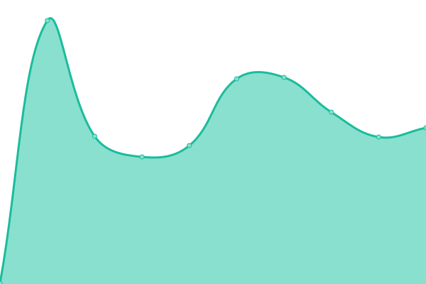

# [📈 Live Status](https://status.fourthestate.org): <!--live status--> **🟩 All systems operational**

This repository contains the open-source uptime monitor and status page for [Fourth Estate®](https://www.fourthestate.org) websites and services, powered by [Upptime](https://github.com/upptime/upptime).

With [Upptime](https://upptime.js.org), you can get your own unlimited and free uptime monitor and status page, powered entirely by a GitHub repository. We use [Issues](https://github.com/FourthEstateOrg/status.fourthestate.org/issues) as incident reports, [Actions](https://github.com/FourthEstateOrg/status.fourthestate.org/actions) as uptime monitors, and [Pages](https://status.fourthestate.org) for the status page.

<!--start: status pages-->
<!-- This summary is generated by Upptime (https://github.com/upptime/upptime) -->
<!-- Do not edit this manually, your changes will be overwritten -->
<!-- prettier-ignore -->
| URL | Status | History | Response Time | Uptime |
| --- | ------ | ------- | ------------- | ------ |
|  [Fourth Estate® Website](https://www.fourthestate.org) | 🟩 Up | [fourth-estate-website.yml](https://github.com/FourthEstateOrg/status.fourthestate.org/commits/HEAD/history/fourth-estate-website.yml) | 

 209ms
     
 | 

<a href="https://status.fourthestate.org/history/fourth-estate-website">100.00%</a>
    

|  [Fourth Estate® Newsroom](https://newsroom.fourthestate.org) | 🟩 Up | [fourth-estate-newsroom.yml](https://github.com/FourthEstateOrg/status.fourthestate.org/commits/HEAD/history/fourth-estate-newsroom.yml) | 

 248ms
     
 | 

<a href="https://status.fourthestate.org/history/fourth-estate-newsroom">100.00%</a>
    

|  [Fourth Estate® NewsHub](https://newshub.fourthestate.org) | 🟩 Up | [fourth-estate-news-hub.yml](https://github.com/FourthEstateOrg/status.fourthestate.org/commits/HEAD/history/fourth-estate-news-hub.yml) | 

 501ms
     
 | 

<a href="https://status.fourthestate.org/history/fourth-estate-news-hub">100.00%</a>
    

|  [Fourth Estate® DailyNewsBrief](https://dailynewsbrief.com) | 🟩 Up | [fourth-estate-daily-news-brief.yml](https://github.com/FourthEstateOrg/status.fourthestate.org/commits/HEAD/history/fourth-estate-daily-news-brief.yml) | 

 318ms
     
 | 

<a href="https://status.fourthestate.org/history/fourth-estate-daily-news-brief">100.00%</a>
    

|  [Cronkite VPS Cluster](https://cronkite.fourthestate.org/) | 🟩 Up | [cronkite-vps-cluster.yml](https://github.com/FourthEstateOrg/status.fourthestate.org/commits/HEAD/history/cronkite-vps-cluster.yml) | 

 1365ms
     
 | 

<a href="https://status.fourthestate.org/history/cronkite-vps-cluster">100.00%</a>
    

|  [Fourth Estate® Website](https://www.fourthestate.org) | 🟩 Up | [fourth-estate-website.yml](https://github.com/FourthEstateOrg/status.fourthestate.org/commits/HEAD/history/fourth-estate-website.yml) | 

 209ms
     
 | 

<a href="https://status.fourthestate.org/history/fourth-estate-website">100.00%</a>
    

|  [Help Desk](https://helpdesk.fourthestate.org) | 🟩 Up | [help-desk.yml](https://github.com/FourthEstateOrg/status.fourthestate.org/commits/HEAD/history/help-desk.yml) | 

 880ms
     
 | 

<a href="https://status.fourthestate.org/history/help-desk">100.00%</a>
    

|  [Job Site](https://jobs.fourthestate.org) | 🟩 Up | [job-site.yml](https://github.com/FourthEstateOrg/status.fourthestate.org/commits/HEAD/history/job-site.yml) | 

 286ms
     
 | 

<a href="https://status.fourthestate.org/history/job-site">100.00%</a>
    

|  [Calendar](https://calendar.fourthestate.org/) | 🟩 Up | [calendar.yml](https://github.com/FourthEstateOrg/status.fourthestate.org/commits/HEAD/history/calendar.yml) | 

 350ms
     
 | 

<a href="https://status.fourthestate.org/history/calendar">100.00%</a>
    

|  [Mail Servers](https://mail.fourthestate.org/) | 🟩 Up | [mail-servers.yml](https://github.com/FourthEstateOrg/status.fourthestate.org/commits/HEAD/history/mail-servers.yml) | 

 716ms
     
 | 

<a href="https://status.fourthestate.org/history/mail-servers">100.00%</a>
    

|  [Ceriph™ [matrix]](https://app.fourthestate.chat/) | 🟩 Up | [ceriph-matrix.yml](https://github.com/FourthEstateOrg/status.fourthestate.org/commits/HEAD/history/ceriph-matrix.yml) | 

 547ms
     
 | 

<a href="https://status.fourthestate.org/history/ceriph-matrix">99.66%</a>
    

<!--end: status pages-->

[**Visit our status website →**](https://status.fourthestate.org)

## 📄 License

- Powered by: [Upptime](https://github.com/upptime/upptime)
- Code: [MIT](./LICENSE) © [Fourth Estate®](https://www.fourthestate.org)
- Data in the `./history` directory: [Open Database License](https://opendatacommons.org/licenses/odbl/1-0/)
